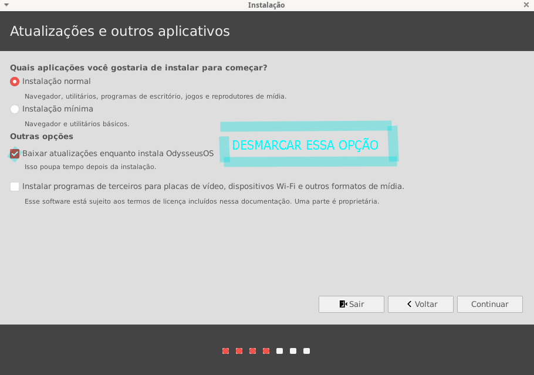
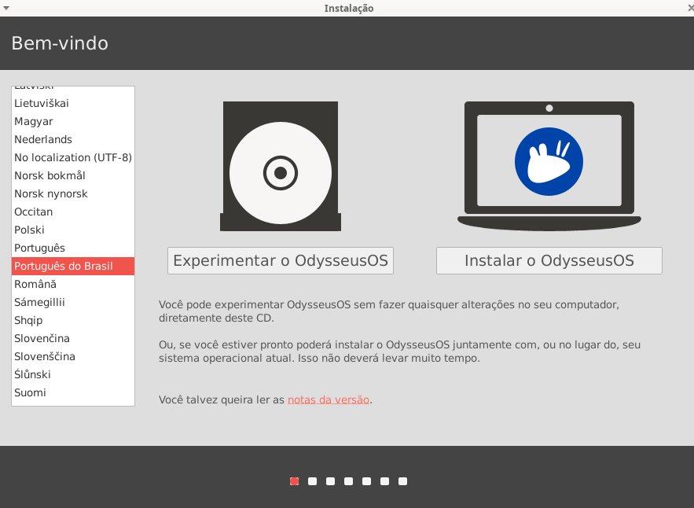
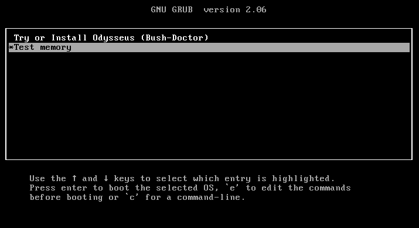
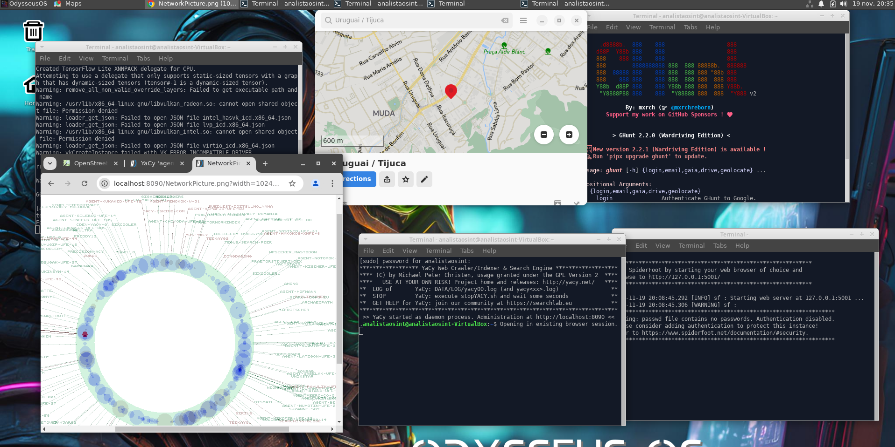
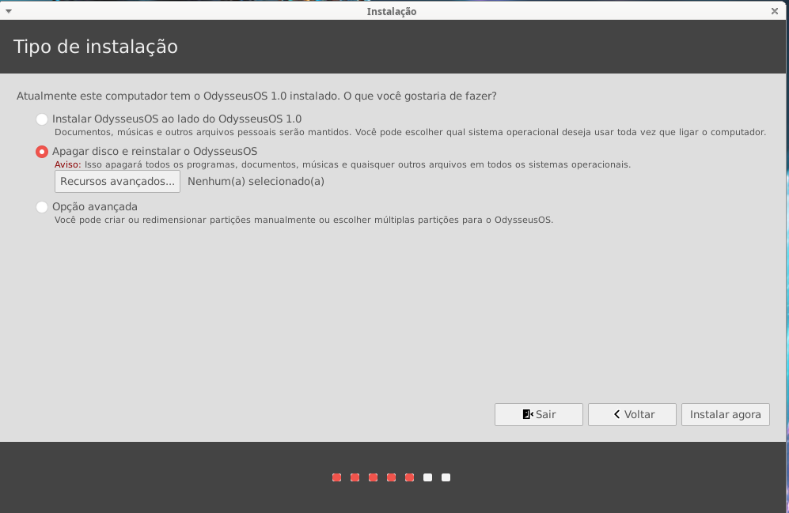
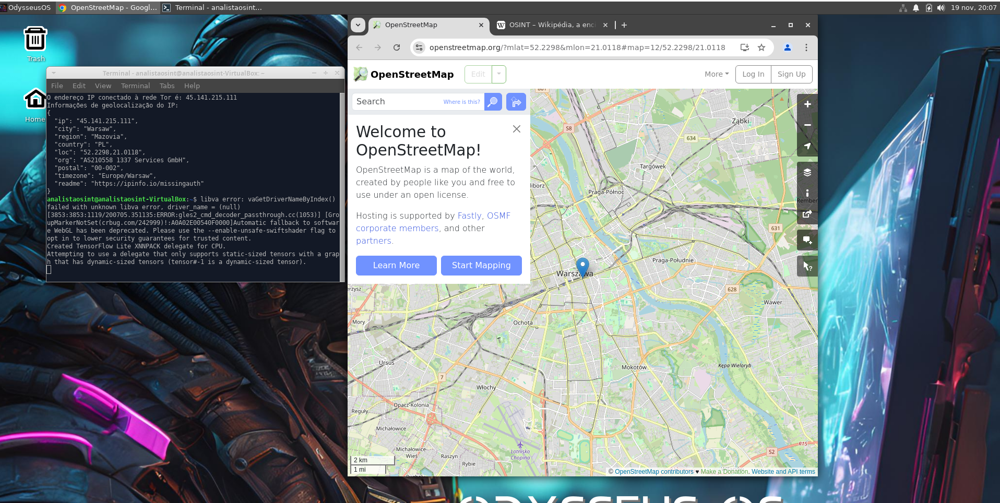
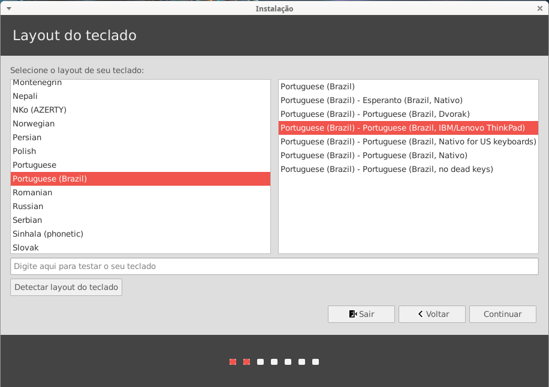

# Odysseus OS

## Visão Geral

**Odysseus OS** é uma distribuição Linux baseada no Xubuntu 22.04, projetada para atender às necessidades de analistas que trabalham com **OSINT** (Open Source Intelligence). Utilizando o ambiente de desktop **XFCE4**, a distribuição combina uma interface leve e intuitiva com uma robusta coleção de ferramentas para coleta e análise de dados de fontes abertas.

## Requisitos do Sistema

- **Processador**: Dual-core de 2 GHz ou superior.
- **Memória RAM**: Mínimo de 4 GB.
- **Espaço em Disco**: 40 GB de espaço livre.

## Recursos e Funcionalidades

### Ferramentas de OSINT

Odysseus OS inclui uma variedade de ferramentas para facilitar investigações, como:

1. **Análise de Redes Sociais**: Coleta de dados de plataformas sociais.
2. **Verificação de Informações**: Validação de fatos e fontes.
3. **Mapeamento Geoespacial**: Visualização de dados em mapas.
4. **Captura de Dados**: Extração de informações de páginas da web.

### Navegação Segura

A distribuição permite o uso da rede **Tor** em conjunto com o **Privoxy**, aumentando a privacidade e segurança durante a navegação.

### Navegador Firefox Enriquecido

Inclui uma versão do **Firefox** configurada com extensões voltadas para OSINT, como:

5. **uBlock Origin**: Bloqueio de anúncios e rastreadores.
6. **Privacy Badger**: Bloqueio automático de rastreadores invisíveis.
7. **NoScript**: Execução de scripts apenas em sites confiáveis.

### Ferramentas de Coleta e Análise

Odysseus OS também integra as seguintes ferramentas:

8. **YaCy**: Criação de mecanismos de busca descentralizados.
9. **SpiderFoot**: Coleta automatizada de dados sobre alvos.
10. **GHunt**: Extração de informações de contas do Google.
11. **Mr.Holmes**: Coleta de informações sobre domínios e usuários.
12. **IVRE**: Análise de vulnerabilidades e coleta de dados.
13. **BBOT**: Levantamento de informações com um único comando.
14. **GoBuster**: Enumeração de URI e subdomínios.
15. **Blackbird**: Pesquisa de contas de usuário em diversas plataformas.

## Instalação

Para instalar o Odysseus OS, siga estas etapas:

1. **Download da ISO**: Baixe a imagem ISO do Odysseus OS [AQUI](https://drive.google.com/file/d/1DrsWkYef9jiaf0EUx-KUfxBMPhDsX9c_/view?usp=sharing).
2. **Criar Disco de Instalação USB**: Use ferramentas como **Rufus** ou **Etcher**.
3. **Iniciar a Partir do USB**: Conecte o USB e inicie a partir dele.
4. **Seguir Instruções**: Complete a instalação conforme as instruções na tela.

### Observação Importante

**ATENÇÃO:** Durante a instalação e enquanto o Odysseus OS estiver em uso, **NÃO marque a opção para fazer atualizações**. Isso pode causar instabilidades e interferir no funcionamento adequado das ferramentas já integradas. É altamente recomendável manter a configuração original para garantir a eficácia das investigações.

**Desmarque a opção de atualização na instalação:**

### Imagens do Processo de Instalação

## Apresentação

Para mais informações sobre o Odysseus OS, você pode acessar a apresentação em PDF [aqui](odysseus-presentation.pdf).

## Licença

Este projeto é licenciado sob a **MIT License**. Consulte o arquivo [LICENSE](LICENSE) para mais detalhes.

## Contato

Para mais informações, entre em contato:

- **Telegram**: [@fqodysseus]

# Odysseus OS - Ferramentas

## O Sistema IPED Forense

**Processador e Indexador de Evidências Digitais da Polícia Federal**

### Introdução

O IPED (Indexador e Processador de Evidências Digitais) é uma ferramenta forense desenvolvida no Brasil, criada para facilitar a análise e o processamento de evidências digitais. Lançada em 2012 por Luís Filipe Nassif, um Perito Criminal Federal, o IPED se tornou uma solução versátil e poderosa para investigações em diversas áreas, incluindo criminal, cível e trabalhista.

### Objetivo

Este projeto visa fornecer uma plataforma robusta para a coleta, análise e apresentação de evidências digitais. Com configurações avançadas e parametrizações específicas, o IPED permite que investigadores personalizem suas abordagens de acordo com as necessidades de cada caso.

### Recursos

- **Análise de Evidências Digitais**: Processamento e indexação de dados digitais de forma eficiente.
- **Configurações Avançadas**: Personalização detalhada para atender a diferentes requisitos de investigação.
- **Código Aberto**: Desde 2019, o IPED é um projeto de código aberto, permitindo que a comunidade contribua e melhore a ferramenta continuamente.

### Link do Projeto

Você pode acessar o IPED no GitHub da Polícia Federal Brasileira: [https://github.com/sepinf-inc/IPED](https://github.com/sepinf-inc/IPED).

## Ferramentas

1. **[IED (IPED)](https://github.com/sepinf-inc/IPED)**: Ferramenta forense para processamento e indexação de evidências digitais.

2. **[Bbot](https://github.com/blacklanternsecurity/bbot)**: Ferramenta de automação para testes de penetração.
   
3. **[Certgraph](https://github.com/lanrat/certgraph)**: Visualização de relações entre certificados SSL.

4. **[Cloud Fail](https://github.com/m0rtem/CloudFail)**: Ferramenta para descobrir subdomínios em serviços de nuvem.

5. **[Cloud Scraper](https://github.com/jordanpotti/CloudScraper)**: Coletor de dados de serviços de nuvem.

6. **[DNS Recon](https://github.com/darkoperator/dnsrecon)**: Ferramenta para reconhecimento de DNS.

7. **[EO Ripper](https://github.com/Quantika14/email-osint-ripper)**: Coletor de informações por e-mail.

8. **[ExifTool](https://exiftool.org/)**: Ferramenta para leitura, escrita e edição de metadados.

9. **[EyeWitness](https://github.com/RedSiege/EyeWitness.git)**: Ferramenta para capturar screenshots de sites.

10. **[GHunt](https://github.com/mxrch/GHunt)**: Coleta de informações de contas do Google.

11. **[Git Recon](https://github.com/GONZOsint/gitrecon)**: Ferramenta para reconhecimento em repositórios Git.

12. **[Gobuster](https://github.com/OJ/gobuster)**: Ferramenta para brute forcing de diretórios e arquivos.

13. **[Hostintel](https://github.com/keithjjones/hostintel)**: Coleta de informações sobre hosts.

14. **[Infoga](https://github.com/m4ll0k/Infoga)**: Coletor de informações de e-mail.

15. **[Instaloader](https://github.com/instaloader/instaloader)**: Ferramenta para download de dados do Instagram.

16. **[IVRE](https://github.com/ivre/ivre)**: Framework para análise de rede.

17. **[Metagoofil](https://github.com/opsdisk/metagoofil)**: Coletor de metadados de documentos.

18. **[Mr. Holmes](https://github.com/Lucksi/Mr.Holmes)**: Ferramenta para pesquisa de informações em redes sociais.

19. **[Pagodo](https://github.com/opsdisk/pagodo)**: Ferramenta para coleta automatizada de informações.

21. **[Photon](https://github.com/s0md3v/Photon)**: Ferramenta para coleta de dados da web.

22. **[Protosint](https://github.com/pixelbubble/ProtOSINT)**: Framework para coleta de informações.

23. **[Scanless](https://github.com/vesche/scanless)**: Ferramenta para realizar varreduras sem ser detectado.

24. **[Sherlock](https://github.com/sherlock-project/sherlock)**: Ferramenta para encontrar perfis de usuários em redes sociais.

25. **[Spiderfoot GUI](https://github.com/smicallef/spiderfoot)**: Interface gráfica para Spiderfoot.

26. **[Tor Bot](https://github.com/DedSecInside/TorBot)**: Bot para navegação anônima.

27. **[WhatWeb](https://github.com/urbanadventurer/WhatWeb)**: Ferramenta para identificar tecnologias usadas em websites.

28. **[XRay](https://github.com/evilsocket/xray)**: Ferramenta para análise de segurança de aplicações web.

## Contribuições

Contribuições são bem-vindas! Sinta-se à vontade para abrir uma issue ou enviar um pull request.

## Licença

Este projeto está licenciado sob a MIT License - veja o arquivo [LICENSE](LICENSE) para mais detalhes.

