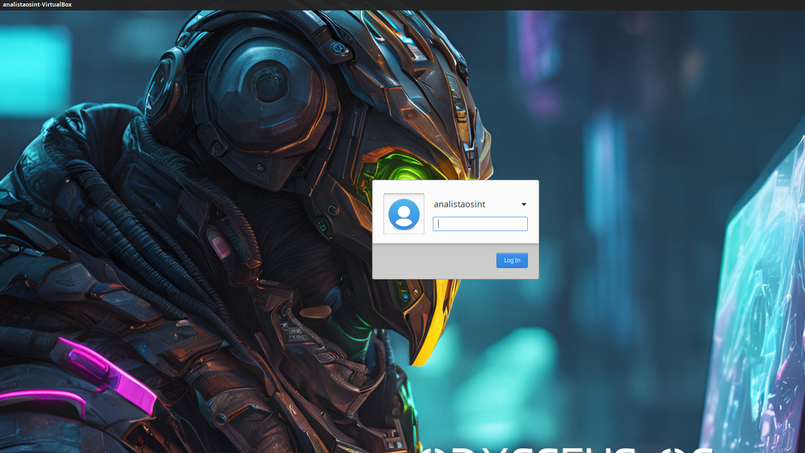

# Odysseus OS

## Visão Geral

**Odysseus OS** é uma distribuição Linux baseada no Xubuntu 22.04, projetada para atender às necessidades de analistas que trabalham com **OSINT** (Open Source Intelligence). Utilizando o ambiente de desktop **XFCE4**, a distribuição combina uma interface leve e intuitiva com uma robusta coleção de ferramentas para coleta e análise de dados de fontes abertas.

## Requisitos do Sistema

- **Processador**: Dual-core de 2 GHz ou superior.
- **Memória RAM**: Mínimo de 4 GB.
- **Espaço em Disco**: 25 GB de espaço livre.

## Recursos e Funcionalidades

### Ferramentas de OSINT

Odysseus OS inclui uma variedade de ferramentas para facilitar investigações, como:

1. **Análise de Redes Sociais**: Coleta de dados de plataformas sociais.
2. **Verificação de Informações**: Validação de fatos e fontes.
3. **Mapeamento Geoespacial**: Visualização de dados em mapas.
4. **Captura de Dados**: Extração de informações de páginas da web.

### Navegação Segura

A distribuição permite o uso da rede **Tor** em conjunto com o **Privoxy**, aumentando a privacidade e segurança durante a navegação.

### Navegador Firefox Enriquecido

Inclui uma versão do **Firefox** configurada com extensões voltadas para OSINT, como:

5. **uBlock Origin**: Bloqueio de anúncios e rastreadores.
6. **Privacy Badger**: Bloqueio automático de rastreadores invisíveis.
7. **NoScript**: Execução de scripts apenas em sites confiáveis.

### Ferramentas de Coleta e Análise

Odysseus OS também integra as seguintes ferramentas:

8. **YaCy**: Criação de mecanismos de busca descentralizados.
9. **SpiderFoot**: Coleta automatizada de dados sobre alvos.
10. **GHunt**: Extração de informações de contas do Google.
11. **Mr.Holmes**: Coleta de informações sobre domínios e usuários.
12. **IVRE**: Análise de vulnerabilidades e coleta de dados.
13. **BBOT**: Levantamento de informações com um único comando.
14. **GoBuster**: Enumeração de URI e subdomínios.
15. **Blackbird**: Pesquisa de contas de usuário em diversas plataformas.

## Instalação

Para instalar o Odysseus OS, siga estas etapas:

1. **Download da ISO**: Baixe a imagem ISO do Odysseus OS [aqui](https://drive.google.com/file/d/1fQdedBn9Y5oxCDPeMPfNhucJ0v_HIIWk/view?usp=sharing).
2. **Criar Disco de Instalação USB**: Use ferramentas como **Rufus** ou **Etcher**.
3. **Iniciar a Partir do USB**: Conecte o USB e inicie a partir dele.
4. **Seguir Instruções**: Complete a instalação conforme as instruções na tela.

### Observação Importante

**ATENÇÃO:** Durante a instalação e enquanto o Odysseus OS estiver em uso, **NÃO marque a opção para fazer atualizações**. Isso pode causar instabilidades e interferir no funcionamento adequado das ferramentas já integradas. É altamente recomendável manter a configuração original para garantir a eficácia das investigações.

**Desmarque a opção de atualização na instalação:**

### Imagens do Processo de Instalação

## Apresentação

Para mais informações sobre o Odysseus OS, você pode acessar a apresentação em PDF [aqui](odysseus-presentation.pdf).

## Contribuição

Contribuições são bem-vindas! Para contribuir:

1. Faça um fork do projeto.
2. Crie uma nova branch para suas alterações.
3. Realize suas alterações e faça commit.
4. Envie suas alterações e abra um Pull Request.

## Licença

Este projeto é licenciado sob a **MIT License**. Consulte o arquivo [LICENSE](LICENSE) para mais detalhes.

## Contato

Para mais informações, entre em contato:

- **Email**: [seu_email@example.com](mailto:seu_email@example.com)

## Links Úteis

# Odysseus OS - Ferramentas

Este repositório contém uma lista de ferramentas incluídas no Odysseus OS, úteis para diversas atividades de OSINT (Inteligência de Fonte Aberta).

## Ferramentas

1. **[Bbot](https://github.com/blacklanternsecurity/bbot)**: Ferramenta de automação para testes de penetração.
   
2. **[Certgraph](https://github.com/lanrat/certgraph)**: Visualização de relações entre certificados SSL.

3. **[Cloud Fail](https://github.com/m0rtem/CloudFail)**: Ferramenta para descobrir subdomínios em serviços de nuvem.

4. **[Cloud Scraper](https://github.com/jordanpotti/CloudScraper)**: Coletor de dados de serviços de nuvem.

5. **[DNS Recon](https://github.com/darkoperator/dnsrecon)**: Ferramenta para reconhecimento de DNS.

6. **[EO Ripper](https://github.com/Quantika14/email-osint-ripper)**: Coletor de informações por e-mail.

7. **[ExifTool](https://exiftool.org/)**: Ferramenta para leitura, escrita e edição de metadados.

8. **[EyeWitness](https://github.com/RedSiege/EyeWitness.git)**: Ferramenta para capturar screenshots de sites.

9. **[GHunt](https://github.com/mxrch/GHunt)**: Coleta de informações de contas do Google.

10. **[Git Recon](https://github.com/GONZOsint/gitrecon)**: Ferramenta para reconhecimento em repositórios Git.

11. **[Gobuster](https://github.com/OJ/gobuster)**: Ferramenta para brute forcing de diretórios e arquivos.

12. **[Hostintel](https://github.com/keithjjones/hostintel)**: Coleta de informações sobre hosts.

13. **[Infoga](https://github.com/m4ll0k/Infoga)**: Coletor de informações de e-mail.

14. **[Instaloader](https://github.com/instaloader/instaloader)**: Ferramenta para download de dados do Instagram.

15. **[IVRE](https://github.com/ivre/ivre)**: Framework para análise de rede.

16. **[Metagoofil](https://github.com/opsdisk/metagoofil)**: Coletor de metadados de documentos.

17. **[Mr. Holmes](https://github.com/Lucksi/Mr.Holmes)**: Ferramenta para pesquisa de informações em redes sociais.

18. **[OSRFramework](https://github.com/i3visio/osrframework)**: Framework para OSINT.

19. **[Pagodo](https://github.com/opsdisk/pagodo)**: Ferramenta para coleta automatizada de informações.

20. **[Phone Infoga](https://github.com/sundowndev/phoneinfoga)**: Coletor de informações de números de telefone.

21. **[Photon](https://github.com/s0md3v/Photon)**: Ferramenta para coleta de dados da web.

22. **[Protosint](https://github.com/pixelbubble/ProtOSINT)**: Framework para coleta de informações.

23. **[Scanless](https://github.com/vesche/scanless)**: Ferramenta para realizar varreduras sem ser detectado.

24. **[Sherlock](https://github.com/sherlock-project/sherlock)**: Ferramenta para encontrar perfis de usuários em redes sociais.

25. **[Spiderfoot CLI](https://github.com/smicallef/spiderfoot)**: Interface de linha de comando para Spiderfoot.

26. **[Spiderfoot GUI](https://github.com/smicallef/spiderfoot)**: Interface gráfica para Spiderfoot.

27. **[TheHarvester](https://github.com/laramies/theHarvester)**: Ferramenta para coleta de e-mails e subdomínios.

28. **[Tor Bot](https://github.com/DedSecInside/TorBot)**: Bot para navegação anônima.

29. **[WhatWeb](https://github.com/urbanadventurer/WhatWeb)**: Ferramenta para identificar tecnologias usadas em websites.

30. **[XRay](https://github.com/evilsocket/xray)**: Ferramenta para análise de segurança de aplicações web.

## Contribuições

Contribuições são bem-vindas! Sinta-se à vontade para abrir uma issue ou enviar um pull request.

## Licença

Este projeto está licenciado sob a MIT License - veja o arquivo [LICENSE](LICENSE) para mais detalhes.

## Contribuições

Contribuições são bem-vindas! Sinta-se à vontade para abrir uma issue ou enviar um pull request.

## Licença

Este projeto está licenciado sob a MIT License - veja o arquivo [LICENSE](LICENSE) para mais detalhes.

---
